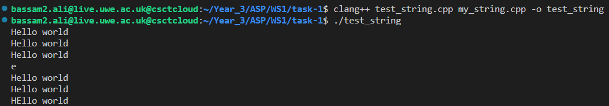
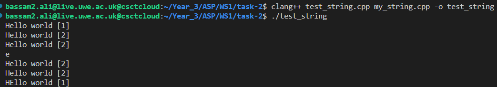
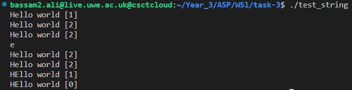
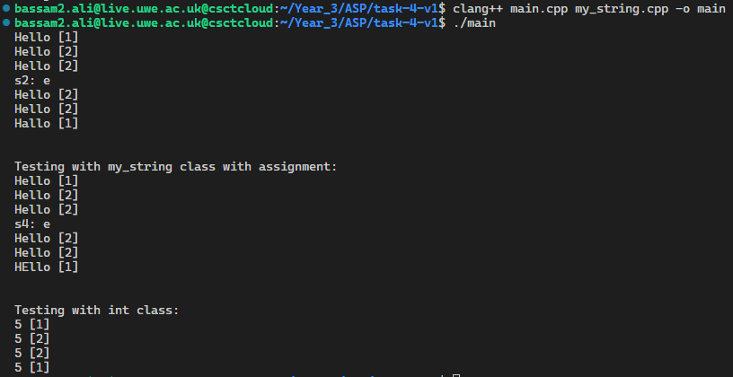

[Task 1](### Task 1)

[Task 2](### Task 2)

[Task 3](###Task 3)

[Task 4](###Task 4)

# ASP Worksheet 1

## Simplified string class and reference counting

### **<u>Task 1**</u>
* This task revolved around developing a simple version of C's string class using dynaminc memory allocation, copy assignment & copy constructors. The class "my_string", is a custom string class implemented to create, modify and print strings

* The class "my_string" contains methods that carry out difference functions. These functions mainly consist of initializing a string from a C language style character array and calculates the size of the string, allocates memory for it and copies the content. 

* Other methods include "getChar()" which returns the character at a specific index in the string and "setChar()" sets the character at specific index in the string

To compile & run:
```bash
clang++ test_string.cpp my_string.cpp -o test_string; ./test_string
```

output:



---

### <u>**Task 2**</u>
* This task was about extending the string class to automate the process of reference counting, by print the test strings, with the reference count printed right after in the format "string [reference count]"

* This was done by initializing a reference count variable in the header file(my_string.hpp) and incrementing or decrementing it depending on the action needed in each method in the my_string class
```int *ref_count;```

* This one of the methods in the my_string class that allows reference counting, this is the copy constructor:
```cpp
//copy constructor to create a copy of the original string
my_string::my_string(const my_string& s)
{
    //copy data pointer, size and reference count
    data = s.data;
    size = s.size;
    ref_count = s.ref_count;
    //increment reference count to indicate another occurence of a copy
    (*ref_count)++;
}

```

To compile & run:
```
clang++ test_string.cpp my_string.cpp -o test_string; ./test_string 
```

output:



---
### <u>**Task 3**</u>
* This task is solely to demonstrate when the reference count reaches 0. The only thing that was changed from the previous task was adding an if statement for when the reference count reaches to 0, and printing it, shown here in the destructor:
```cpp
my_string::~my_string()
{
    *ref_count -= 1;
    if (*ref_count == 0)
    {
        //print called to demonstrate case of reference count of 0
        print();
        delete ref_count;
        delete[] data;
    }
}
```


to compile & run:
```
clang++ test_string.cpp my_string.cpp -o test_string; ./test_string
```

output:



---
### <u>**Task 4**</u>
* This task was to implement reference counting outside the my_string class and in a seperate header file (ref_count.hpp). That was done using a template class with methods that allow reference counting in the main.cpp file

* For this task, a template class was implemented to help manage reference counting for some data. It holds a pointer to the object of type X, and keeps count of the number of references to that object. This reference counting class is made to work with any class.

* To test the implementation, three tests in total were put in place. two for the my_string class (one of them using the assignment operator), and one for int class, as shown here:
```cpp
reference_count<my_string> s(new my_string("Hello"));
    s.print();
    {
        reference_count<my_string> s2(s);
        s.print();
        s2.print();
        std::cout << "s2: " << s2->getChar(1) << std::endl;
        s.print();
        s2.print();
    }
    s->setChar(1, 'a');
    s.print();
```
```cpp
reference_count<my_string> s3(new my_string("Hello"));
    s3.print();
    {
        reference_count<my_string> s4 = s3;
        s3.print();
        s4.print();
        std::cout << "s4: " << s4->getChar(1) << std::endl;
        s3.print();
        s4.print();
    }
    s3->setChar(1, 'E');
    s3.print();
```
```cpp
reference_count<int> i(new int(5));
    i.print();
    {
        reference_count<int> i2(i);
        i.print();
        i2.print();
    }
    i.print();
```

to compile & run:
```
clang++ main.cpp my_string.cpp -o main
```

output:




