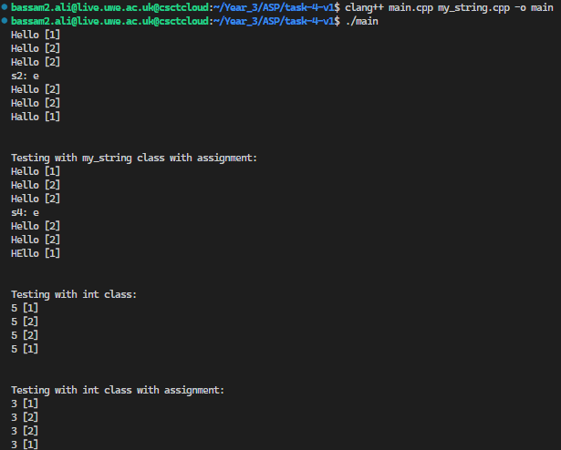

# ASP Worksheet 1

## Simplified string class and reference counting

### Task 1
* This task revolved around developing a simple version of C's string class using dynaminc memory allocation, copy assignment & copy constructors. The class "my_string", is a custom string class implemented to create, modify and print strings

### Task 2
* This task was about extending the string class to automate the process of reference counting, by print the test strings, with the reference count printed right after in the format "string [reference count]"

* This was done by initializing a reference count variable in the header file(my_string.hpp) and incrementing or decrementing it depending on the action needed in each method in the my_string class

### Task 3
* This task is solely to demonstrate when the reference count reaches 0. The only thing that was changed from the previous task was adding an if statement for when the reference count reaches to 0, and printing it

### Task 4
* This task was to implement reference counting outside the my_string class and in a seperate header file (ref_count.hpp). That was done using a template class with methods that allow reference counting in the main.cpp file

